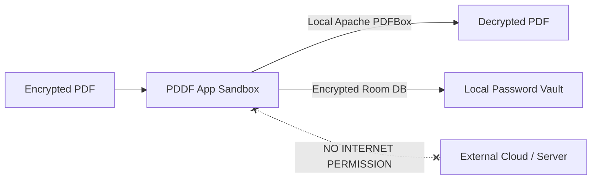

<div align="center">

# 📄 PDDF — PDF Decryptor for Android

**A modern, lightweight, privacy-first Android app to batch decrypt password-protected PDF files 100% locally on your device.**

[-3DDC84?style=flat-square&logo=android&logoColor=white)](https://android.com)
[](https://kotlinlang.org)
[](https://developer.android.com/jetpack/compose)
[](#-privacy--security-by-design)
[](LICENSE)
[](#-testing--code-coverage)

[English](README.md) • [繁體中文](README_zh.md)

</div>

---

## 📖 Overview

**PDDF (PDF Decryptor)** is an open-source Android utility built with **Kotlin** and **Jetpack Compose (Material 3)**. It is designed to remove passwords from protected PDF documents (such as bank statements, pay slips, and digital contracts) quickly, safely, and effortlessly.

Unlike online PDF unlock services that require uploading sensitive documents to cloud servers, PDDF executes all decryption computations **100% locally** using the embedded Apache PDFBox Android engine. The application requests **zero internet permissions**, guaranteeing that your documents, passwords, and private data never leave your device.

---

## ✨ Key Features

| Feature | Description |
| :--- | :--- |
| ⚡ **Batch PDF Decryption** | Select and decrypt multiple encrypted PDFs simultaneously with asynchronous background I/O to ensure zero UI lag. |
| 🛡️ **100% Offline & Zero-Knowledge** | Operates strictly offline without `android.permission.INTERNET`. No telemetry, no tracking, and no external data transmission. |
| 🔑 **Local Password Vault** | Save and categorize frequently used PDF passwords in a secure local Room Database with instant autofill and auto-unlock. |
| 📲 **Seamless Android Integration** | Open or share PDFs directly from File Managers, WhatsApp, LINE, Email, or Web Browsers via system `ACTION_VIEW` and `ACTION_SEND` intents. |
| ⚡ **Quick Access & Shortcuts** | Quick Settings (QS) Tile for one-tap access and dynamic App Launcher Shortcuts for fast document selection and password management. |
| ⚙️ **Smart File Management** | Choose between **Save as Copy** (with custom prefixing) or **Overwrite Original** in-place, plus optional automatic deletion of original encrypted files. |
| 👁️ **Built-in PDF Preview** | Preview decrypted PDF pages directly within the app before opening in external viewers or sharing. |
| 🎨 **Material You / Material 3 UI** | Modern, responsive interface with dynamic color theming, full Dark/Light mode support, edge-to-edge display, and predictive back gestures. |
| 🌐 **Bilingual Localization** | Native support for English and Traditional Chinese (`zh-rTW`). |

---

## 🔒 Privacy & Security by Design

Privacy is the core pillar of PDDF:



1. **Zero Internet Access**: The `AndroidManifest.xml` does not declare `android.permission.INTERNET`. The app is physically incapable of making network requests or leaking files.
2. **Local Processing**: Decryption is executed entirely on-device via Apache PDFBox Android.
3. **Backup Exclusion**: `data_extraction_rules.xml` and `backup_rules.xml` explicitly prevent saved passwords and database files from being uploaded to Google Cloud Backup or transferred to unauthorized backup devices.
4. **No Third-Party SDKs**: Zero analytics, zero ad networks, and zero tracking dependencies.

---

## 🏗️ Architecture & Tech Stack

PDDF follows Modern Android Development (MAD) best practices with Clean Architecture and Unidirectional Data Flow (UDF):

```
PDDF Architecture
├── Presentation Layer (Jetpack Compose + Material 3)
│   └── MainActivity.kt ── MainViewModel.kt (StateFlow / UDF)
├── Domain & Business Logic Layer
│   └── Apache PDFBox Android Engine ── FileUtils (SAF / ContentResolver)
└── Data Layer (Room Persistence Library)
    └── AppDatabase ── PasswordDao ── PasswordRepository
```

### Technology Highlights

- **UI & Toolkit**: [Jetpack Compose](https://developer.android.com/jetpack/compose) (BOM 2024.09), Material Design 3, Compose Navigation.
- **Language & Runtime**: [Kotlin 2.2.10](https://kotlinlang.org/), Kotlin Coroutines, StateFlow (`collectAsStateWithLifecycle`).
- **Database**: [Room 2.7.0](https://developer.android.com/training/data-storage/room) with Kotlin Symbol Processing (KSP 2.3.5).
- **PDF Engine**: [Apache PDFBox Android](https://github.com/TomRous/PdfBox-Android) (`2.0.27.0`).
- **Dependency & App Startup**: AndroidX App Startup (`1.2.0`) for lazy engine initialization.
- **Build System**: Android Gradle Plugin (AGP `9.1.1`), Gradle Kotlin DSL (`build.gradle.kts`), Version Catalogs (`libs.versions.toml`).
- **Quality & Testing**:
  - **Unit Testing**: JUnit 4, Robolectric (`4.16.1`), Kotlinx Coroutines Test.
  - **Code Coverage**: JaCoCo (`0.8.12`) with HTML/XML report generation.
  - **Screenshot Verification**: Roborazzi (`1.59.0`).

---

## ⚡ APK & Performance Optimizations

PDDF is engineered for a minimal footprint and fast startup times:

- **R8 Full Mode & Minification**: ProGuard optimizations with unused code and resource shrinking (`isMinifyEnabled = true`, `isShrinkResources = true`).
- **CMap & Font Preservation**: Targeted keep rules for PDFBox font tables to prevent garbled text while eliminating unnecessary byte bloat.
- **Resource & Locale Filtering**: Restricts bundled string resources strictly to `en` and `zh-rTW` (`localeFilters += listOf("zh-rTW", "en")`).
- **AAB Dynamic Delivery**: Optimized dynamic ABI splitting (`arm64-v8a`, `armeabi-v7a`, `x86_64`) for minimal Google Play download sizes (< 5 MB).

---

## 🚀 Getting Started & Building from Source

### Prerequisites

- **JDK**: Java Development Kit 17 or higher
- **Android SDK**: Android SDK API Level 35 (Build-Tools 35.0.0+)
- **Android Studio**: Android Studio Ladybug / Meerkat (or IntelliJ IDEA / CLI)

### 1. Clone the Repository

```bash
git clone https://github.com/Max97k/PDDF.git
cd PDDF
```

### 2. Build the Project

#### On Windows (PowerShell):
```powershell
# Build Debug APK
.\gradlew.bat assembleDebug

# Build Release APK / Bundle
.\gradlew.bat assembleRelease
```

#### On macOS / Linux:
```bash
# Build Debug APK
./gradlew assembleDebug

# Build Release APK / Bundle
./gradlew assembleRelease
```

The compiled APK will be located at:
`app/build/outputs/apk/debug/app-debug.apk`

---

## 🧪 Testing & Code Coverage

### Run JVM Unit Tests
```powershell
# Windows
.\gradlew.bat :app:testDebugUnitTest

# macOS / Linux
./gradlew :app:testDebugUnitTest
```

### Generate JaCoCo Code Coverage Report
```powershell
# Windows
.\gradlew.bat :app:jacocoTestReport

# macOS / Linux
./gradlew :app:jacocoTestReport
```

HTML coverage reports will be generated at:
`app/build/reports/jacoco/jacocoTestReport/html/index.html`

---

## 📁 Project Structure

```text
PDDF/
├── app/
│   ├── src/
│   │   ├── main/
│   │   │   ├── java/com/example/
│   │   │   │   ├── MainActivity.kt              # Compose UI entry & Intent handling
│   │   │   │   ├── MainViewModel.kt             # UDF State Management & Decryption Engine
│   │   │   │   ├── PdfDecryptorTileService.kt   # Android Quick Settings Tile
│   │   │   │   ├── data/                        # Room Database & Repository Pattern
│   │   │   │   │   ├── AppDatabase.kt
│   │   │   │   │   ├── PasswordDao.kt
│   │   │   │   │   ├── PasswordEntity.kt
│   │   │   │   │   └── PasswordRepository.kt
│   │   │   │   ├── initializer/                 # AndroidX App Startup Initializers
│   │   │   │   ├── ui/theme/                    # Material 3 Design System (Color, Typography, Theme)
│   │   │   │   └── util/                        # SAF Uri Resolver & File I/O Utilities
│   │   │   ├── res/
│   │   │   │   ├── values/                      # Default string resources (English)
│   │   │   │   ├── values-zh-rTW/               # Traditional Chinese string resources
│   │   │   │   └── xml/                         # Security backup rules & app shortcuts
│   │   │   └── AndroidManifest.xml              # Manifest with Zero Network Permissions
│   │   └── test/                                # JUnit4 & Robolectric Unit Tests
│   ├── build.gradle.kts                         # App module build configuration & ProGuard rules
│   └── proguard-rules.pro                       # R8 / ProGuard optimization rules
├── gradle/libs.versions.toml                    # Gradle Version Catalog
├── build.gradle.kts                             # Root build script
├── settings.gradle.kts                          # Project settings
├── AGENTS.md                                    # AI & Developer Contribution Guidelines
├── Privacy_Policy.md                            # Privacy Policy
├── README.md                                    # Project documentation (English)
└── README_zh.md                                 # Project documentation (繁體中文)
```

---

## 🤝 Contributing

Contributions are warmly welcomed! If you'd like to improve PDDF:

1. **Fork** the repository.
2. **Create** a feature branch: `git checkout -b feature/awesome-feature`.
3. **Commit** your changes following conventional commits: `git commit -m "feat: add support for xyz"`.
4. **Run Tests**: Ensure all unit tests and lint checks pass (`.\gradlew.bat :app:testDebugUnitTest`).
5. **Push** to your branch: `git push origin feature/awesome-feature`.
6. **Open a Pull Request**.

Please review our [AGENTS.md](AGENTS.md) for architectural contracts and coding conventions.

---

## 📄 License

This project is licensed under the **MIT License** — see the [LICENSE](LICENSE) file for details.

---

## 🙏 Acknowledgements

- [Apache PDFBox Android](https://github.com/TomRous/PdfBox-Android) by Tom Roush
- [Jetpack Compose](https://developer.android.com/jetpack/compose) by Google Android Team
- [Material Design 3](https://m3.material.io/)
