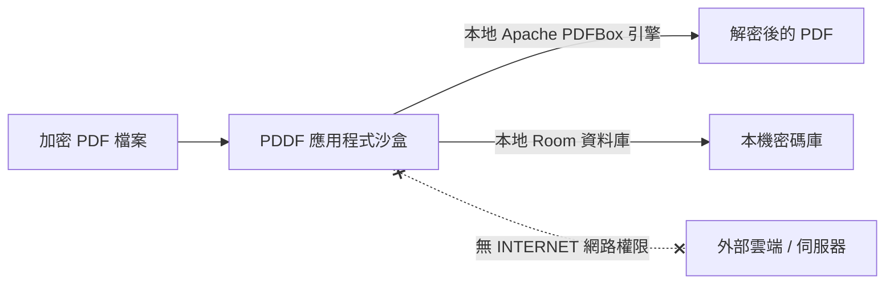

<div align="center">

# 📄 PDDF — Android 本地批量 PDF 密碼解密工具

**一款現代化、輕量、極度注重隱私的開源 Android 應用程式，在您的裝置本機 100% 離線批量解除 PDF 密碼保護。**

[-3DDC84?style=flat-square&logo=android&logoColor=white)](https://android.com)
[](https://play.google.com/apps/testing/com.max97k.pddf)
[](https://kotlinlang.org)
[](https://developer.android.com/jetpack/compose)
[](#-隱私與安全架構設計)
[](LICENSE)
[](#-測試與程式碼覆蓋率)

[English](README.md) • [繁體中文](README_zh.md)

</div>

---

## 📲 加入 Google Play 測試計畫

PDDF 目前正在 Google Play 進行公開/封閉測試，歡迎點擊下方連結加入測試並體驗最新版本：

* 📱 **Android 裝置直接加入**：[https://play.google.com/store/apps/details?id=com.max97k.pddf](https://play.google.com/store/apps/details?id=com.max97k.pddf)
* 🌐 **網頁版加入測試**：[https://play.google.com/apps/testing/com.max97k.pddf](https://play.google.com/apps/testing/com.max97k.pddf)

---

## 📖 專案簡介

**PDDF (PDF Decryptor)** 是一款使用 **Kotlin** 與 **Jetpack Compose (Material 3)** 打造的現代化 Android 開源工具。專為快速、安全、批次解除各類受密碼保護的 PDF 文件（例如：銀行電子對帳單、薪資單、電子合約與保單）而設計。

市面上許多 PDF 解密服務需要將檔案上傳至第三方雲端伺服器，潛藏個人資料與機密外洩的風險。PDDF 透過內建的 Apache PDFBox Android 核心，**100% 在手機本地端**完成所有解密運算。本應用程式在系統清單中**完全未宣告任何網路權限 (`INTERNET`)**，從根本上確保您的私密檔案、密碼與個人資料絕不離開您的裝置！

---

## ✨ 核心特色

| 功能 | 說明 |
| :--- | :--- |
| ⚡ **批量 PDF 解密** | 支援一次選取多個加密 PDF 進行批次處理，底層採用 Coroutines 非同步 I/O 排程，操作流暢不卡頓。 |
| 🛡️ **100% 離線與零知識隱私** | 嚴格離線運作，完全無 `android.permission.INTERNET` 網路權限，無任何追蹤分析 SDK 或外部數據回傳。 |
| 🔑 **本地安全密碼庫** | 透過 Room 本地資料庫儲存常用 PDF 密碼群組，支援自動比對嘗試解鎖與一鍵填入，省去每次手動輸入。 |
| 📲 **系統級無縫整合** | 支援 Android 系統 Intent（`ACTION_VIEW`、`ACTION_SEND` 與 `ACTION_SEND_MULTIPLE`），可直接從檔案總管、LINE、WhatsApp、Email 或瀏覽器點擊 PDF 開啟解密。 |
| ⚡ **快捷捷徑與磁貼** | 支援下拉控制中心快速設定磁貼（Quick Settings Tile）及桌面應用程式長按捷徑（App Shortcuts），一秒啟動解密或管理密碼庫。 |
| ⚙️ **彈性檔案輸出管理** | 支援「另存新檔（可自訂前綴命名）」與「原檔直接覆蓋」模式，並可設定解密成功後是否自動刪除原始加密檔。 |
| 👁️ **內建 PDF 頁面預覽** | 解密後可直接在應用程式內滑動預覽 PDF 頁面內容，確認無誤後一鍵分享或透過外部閱讀器開啟。 |
| 🎨 **Material 3 現代美學** | 採用 Material You 動態色彩適配、深色/淺色主題無縫切換、全螢幕 Edge-to-Edge 沉浸式佈局與預測性返回手勢（Predictive Back）。 |
| 🌐 **完整雙語在地化** | 完整支援英文與繁體中文（台灣 `zh-rTW`）介面。 |

---

## 🔒 隱私與安全架構設計

安全與隱私是 PDDF 最核心的設計承諾：



1. **實體層無網路權限**：`AndroidManifest.xml` 中無任何 `android.permission.INTERNET`，從系統底層杜絕任何聯網與資料外洩可能。
2. **本機封閉運算**：所有 PDF 解密演算法皆由裝置本地的 Apache PDFBox Android 執行。
3. **雲端備份排除保護**：設定了 `data_extraction_rules.xml` 與 `backup_rules.xml`，防止已儲存的密碼庫資料被同步上傳至 Google 雲端備份或未授權的裝置移轉程序。
4. **零第三方追蹤 SDK**：不包含任何廣告 SDK、Firebase Analytics 或遙測工具。

---

## 🏗️ 架構設計與技術棧

PDDF 遵循 Google 官方推廣的現代 Android 開發標準（MAD），採用 MVVM 架構與單向資料流（Unidirectional Data Flow）：

```
PDDF 架構分層
├── 展示層 (Jetpack Compose + Material 3)
│   └── MainActivity.kt ── MainViewModel.kt (StateFlow / UDF)
├── 領域與業務邏輯層
│   └── Apache PDFBox Android 核心 ── FileUtils (SAF / ContentResolver)
└── 資料存取層 (Room Persistence Library)
    └── AppDatabase ── PasswordDao ── PasswordRepository
```

### 技術棧一覽

- **UI 框架**：[Jetpack Compose](https://developer.android.com/jetpack/compose) (BOM 2024.09), Material Design 3, Compose Navigation
- **開發語言與非同步**：[Kotlin 2.2.10](https://kotlinlang.org/)、Kotlin Coroutines、StateFlow (`collectAsStateWithLifecycle`)
- **本機資料庫**：[Room 2.7.0](https://developer.android.com/training/data-storage/room) 搭配 Kotlin Symbol Processing (KSP 2.3.5)
- **PDF 解密引擎**：[Apache PDFBox Android](https://github.com/TomRous/PdfBox-Android) (`2.0.27.0`)
- **啟動初始化**：AndroidX App Startup (`1.2.0`)
- **建置工具**：Android Gradle Plugin (AGP `9.1.1`)、Gradle Kotlin DSL (`build.gradle.kts`)、Version Catalogs (`libs.versions.toml`)
- **測試與品質保證**：
  - **單元測試**：JUnit 4, Robolectric (`4.16.1`), Kotlinx Coroutines Test
  - **覆蓋率分析**：JaCoCo (`0.8.12`) 支援 HTML/XML 報告
  - **截圖回歸測試**：Roborazzi (`1.59.0`)

---

## ⚡ 體積與效能最佳化

PDDF 針對安裝包體積與啟動速度進行了深度最佳化：

- **R8 Full Mode 混淆與壓縮**：啟用 `isMinifyEnabled = true` 與 `isShrinkResources = true`，精準剔除未引用程式碼與資產。
- **PDFBox 字型與 CMap 映射保留**：精確保留解密與中文字型渲染所需的 CMap 規則，杜絕解密後亂碼問題。
- **語系資源過濾**：設定 `localeFilters += listOf("zh-rTW", "en")`，剔除第三方依賴庫中多餘的數十種語言資產包。
- **AAB 依架構動態分發**：透過 Google Play AAB 動態分割 ABI (`arm64-v8a`, `armeabi-v7a`, `x86_64`)，使用者下載體積小於 5 MB。

---

## 🚀 從原始碼建置專案

### 環境需求

- **JDK**：Java Development Kit 17 或以上
- **Android SDK**：API Level 35 (Build-Tools 35.0.0+)
- **開發工具**：Android Studio Ladybug / Meerkat (或命令列工具)

### 1. 複製專案庫

```bash
git clone https://github.com/Max97k/PDDF.git
cd PDDF
```

### 2. 編譯 APK

#### Windows (PowerShell):
```powershell
# 編譯 Debug 版本 APK
.\gradlew.bat assembleDebug

# 編譯 Release 版本 APK / Bundle
.\gradlew.bat assembleRelease
```

#### macOS / Linux:
```bash
# 編譯 Debug 版本 APK
./gradlew assembleDebug

# 編譯 Release 版本 APK / Bundle
./gradlew assembleRelease
```

編譯完成的 APK 檔案位於：
`app/build/outputs/apk/debug/app-debug.apk`

---

## 🧪 測試與程式碼覆蓋率

### 執行單元測試
```powershell
# Windows
.\gradlew.bat :app:testDebugUnitTest

# macOS / Linux
./gradlew :app:testDebugUnitTest
```

### 產出 JaCoCo 覆蓋率報告
```powershell
# Windows
.\gradlew.bat :app:jacocoTestReport

# macOS / Linux
./gradlew :app:jacocoTestReport
```

HTML 格式的覆蓋率報告將產出於：
`app/build/reports/jacoco/jacocoTestReport/html/index.html`

---

## 📁 專案檔案目錄結構

```text
PDDF/
├── app/
│   ├── src/
│   │   ├── main/
│   │   │   ├── java/com/example/
│   │   │   │   ├── MainActivity.kt              # Compose UI 進入點與 Intent 路由
│   │   │   │   ├── MainViewModel.kt             # UDF 狀態管理與解密業務邏輯
│   │   │   │   ├── PdfDecryptorTileService.kt   # Android 快速設定下拉磁貼服務
│   │   │   │   ├── data/                        # Room 本地資料庫與儲存庫模式
│   │   │   │   │   ├── AppDatabase.kt
│   │   │   │   │   ├── PasswordDao.kt
│   │   │   │   │   ├── PasswordEntity.kt
│   │   │   │   │   └── PasswordRepository.kt
│   │   │   │   ├── initializer/                 # AndroidX App Startup 初始化器
│   │   │   │   ├── ui/theme/                    # Material 3 設計規範 (色彩、排版、主題)
│   │   │   │   └── util/                        # SAF Uri 解析與檔案 I/O 工具類
│   │   │   ├── res/
│   │   │   │   ├── values/                      # 預設字串與語系資源 (English)
│   │   │   │   ├── values-zh-rTW/               # 繁體中文語系資源
│   │   │   │   └── xml/                         # 安全備份規則與應用程式捷徑設定
│   │   │   └── AndroidManifest.xml              # 應用程式資訊清單 (無網路權限)
│   │   └── test/                                # JUnit4 & Robolectric 單元測試套件
│   ├── build.gradle.kts                         # App 模組建置設定與 ProGuard 規則
│   └── proguard-rules.pro                       # R8 / ProGuard 程式碼縮減混淆規則
├── gradle/libs.versions.toml                    # Gradle 版本目錄 (Version Catalog)
├── build.gradle.kts                             # 根專案建置腳本
├── settings.gradle.kts                          # 專案設定檔
├── AGENTS.md                                    # 開發與 AI 代理人規範手冊
├── Privacy_Policy.md                            # 隱私權政策
├── README.md                                    # 專案英文說明文件
└── README_zh.md                                 # 專案繁體中文說明文件
```

---

## 🤝 參與貢獻與回饋

歡迎任何形式的貢獻（包含新功能建議、介面優化與錯誤修正）！

1. **Fork** 本專案庫。
2. **建立** 您的功能分支：`git checkout -b feature/awesome-feature`。
3. **提交** 變更並遵循 Conventional Commits 規範：`git commit -m "feat: add support for xyz"`。
4. **驗證** 確保所有單元測試與 Lint 檢查皆通過（`.\gradlew.bat :app:testDebugUnitTest`）。
5. **推動** 至遠端分支：`git push origin feature/awesome-feature`。
6. **發送 Pull Request**。

若需更詳細的架構約定與代碼規範，請參閱 [AGENTS.md](AGENTS.md)。

---

## 📄 開源授權

本專案採用 **MIT License** 授權釋出，詳情請參閱 [LICENSE](LICENSE) 檔案。

---

## 🙏 致謝與依賴開源項目

- [Apache PDFBox Android](https://github.com/TomRous/PdfBox-Android) by Tom Roush
- [Jetpack Compose](https://developer.android.com/jetpack/compose) by Google Android Team
- [Material Design 3](https://m3.material.io/)
